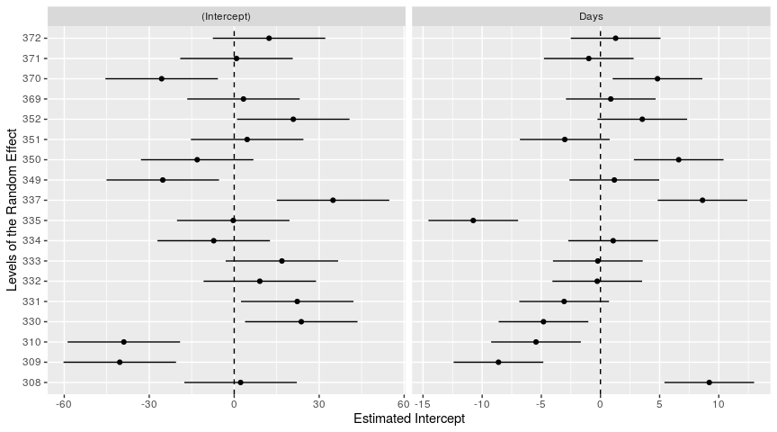

# Steve’s Miscellaneous Functions

[](https://cran.r-project.org/package=stevemisc)
[](https://cran.r-project.org/package=stevemisc)
[](https://cran.r-project.org/package=stevemisc)
[](https://cran.r-project.org/package=stevemisc)


`{stevemisc}` is an R package that includes various functions and tools
that I have written over the years to assist me in my research. I offer
it here for a public release because 1) I am vain and think I privately
want an entire, eponymous ecosystem in the R programming language
(i.e. the “steveverse”) and 2) I think there are tools here that are
broadly useful for users that I’m trying to bundle with other things
that I offer (prominently
[`{steveproj}`](https://github.com/svmiller/steveproj)). The usage
section will elaborate some of its uses.

## Installation

When the time comes, you can install this on CRAN.

``` r
install.packages("stevemisc")
```

Right now, this package in development and is not available on CRAN. You
can install the development version of `{stevemisc}` from Github via the
`{devtools}` package. I suppose using the `{remotes}` package would work
as well.

``` r
devtools::install_github("svmiller/stevemisc")
```

## Usage

The documentation files will include several of these as “examples.” I
offer them here as proofs of concept. There are lots of cool stuff in
`{stevemisc}` and I cannot review all of them here. Instead, I’ll offer
what I think are the most important ones.

### `carrec()`: A Port of `car::recode()`

`carrec()` (phonetically: “car-wreck”) is a simple port of
`car::recode()` that I put in this package because of various function
clashes in the `{car}` package. For those who cut their teeth on Stata,
this package offers Stata-like recoding features that are tough to find
in the R programming language. It comes with a shortcut as well,
`carr()`.

For example, assume the following vector that is some variable of
interest on a 1-10 scale. You want to code the variables that are 6 and
above to be 1 and code the variables of 1-5 to be 0. Here’s how you
would do that.

``` r
library(tidyverse)
library(stevemisc)
x <- seq(1, 10)
x
#>  [1]  1  2  3  4  5  6  7  8  9 10

carrec(x, "1:5=0;6:10=1")
#>  [1] 0 0 0 0 0 1 1 1 1 1
carr(x, "1:5=0;6:10=1")
#>  [1] 0 0 0 0 0 1 1 1 1 1
```

### `cor2data()`: Simulate Variables from a Standard Normal Distribution with Pre-Specified Correlations

`cor2data()` is great for instructional purposes for simulating data
from a standard normal distribution in which the ensuing data are
generated to approximate some pre-specified correlations. This is useful
for teaching how statistical models are supposed to operate under ideal
circumstances. For example, here’s how [I used this function to teach
about instrumental variable
models](http://post8000.svmiller.com/lab-scripts/instrumental-variables-lab.html).
Notice the correlations I devise and how they satisfy they assumptions
of exclusion, exogeneity, and relevance.

``` r
vars = c("control", "treat", "instr", "e")
Cor <- matrix(cbind(1, 0, 0, 0,
                    0, 1, 0.85, -0.5,
                    0, 0.85, 1, 0,
                    0, -0.5, 0, 1),nrow=4)
rownames(Cor) <- colnames(Cor) <- vars

Fake <- as_tibble(cor2data(Cor, 1000, 8675309)) # Jenny I got your number...
Fake$y <- with(Fake, 5 + .5*control + .5*treat + e)

Fake
#> # A tibble: 1,000 x 5
#>    control   treat   instr       e     y
#>      <dbl>   <dbl>   <dbl>   <dbl> <dbl>
#>  1 -0.997   0.722   0.288  -0.220   4.64
#>  2  1.07    0.987   0.854  -0.260   5.77
#>  3  0.572   0.904  -0.0482 -1.38    4.36
#>  4  0.150  -0.660  -1.08    0.148   4.89
#>  5 -0.442  -0.901  -0.845   0.0682  4.40
#>  6  1.99    0.0440 -0.176  -0.497   5.52
#>  7 -0.415   0.683   0.944   0.383   5.52
#>  8 -0.186   0.383   0.524   0.475   5.57
#>  9  1.57    0.589   0.176  -0.863   5.22
#> 10  0.0639 -0.313  -0.397  -0.0922  4.78
#> # … with 990 more rows
```

### `corvectors()`: Create Multivariate Data by Permutation

`corvectors()` is a port of `correlate()` from the `{correlate}`
package. This package is no longer on CRAN, but it’s wonderful for
creating multivariate data with set correlations in which variables can
be on any number of raw scales. I used this function to create fake data
to mimic the API data in `{survey}`, which I make available as `fakeAPI`
in the `{stevedata}` package. Here is a smaller version of that.

``` r
data(api, package="survey")
cormatrix <- cor(apipop %>%
                   select(meals, col.grad, full) %>% na.omit)

nobs <- 1e3

corvectors(cbind(runif(nobs, 0, 100),
                 rbnorm(nobs, 20.73, 14.14, 0, 100),
                 rbnorm(nobs, 87.52, 12.93, 0, 100)), cormatrix) %>% 
  as.data.frame() %>% as_tibble() %>%
  rename(meals = V1, colgrad = V2, fullqual = V3)
#>            [,1]       [,2]       [,3]
#> [1,]  1.0000000 -0.6820878 -0.4859981
#> [2,] -0.6820878  1.0000000  0.3232029
#> [3,] -0.4859981  0.3232029  1.0000000
#> # A tibble: 1,000 x 3
#>     meals colgrad fullqual
#>     <dbl>   <dbl>    <dbl>
#>  1 17.9     18.3      98.4
#>  2 10.5     46.0      81.2
#>  3 17.0     21.8      89.6
#>  4 75.5     34.8      79.4
#>  5 71.6     10.4      82.6
#>  6 72.0     24.4      91.6
#>  7 65.3     35.2      82.3
#>  8 95.2      3.68     82.7
#>  9  0.100   41.8      98.3
#> 10  9.58    40.5      99.5
#> # … with 990 more rows
```

### `db_lselect()`: Lazily Select Variables From Multiple Tables in a Relational Database

`db_lselect()` allows you to select variables from multiple tables in an
SQL database. It returns a lazy query that combines all the variables
together into one data frame (as a tibble). The user can choose to run
`collect()` after this query if they see fit. [I wrote about this on my
website in
2020](http://svmiller.com/blog/2020/11/smarter-ways-to-store-your-wide-data-with-sql-magic-purrr/)
and how it applies to real-world problems. Here is a proof of concept of
how this works.

``` r
library(DBI)
library(RSQLite)
set.seed(8675309)

A <- data.frame(uid = c(1:10),
                a = rnorm(10),
                b = sample(letters, 10),
                c = rbinom(10, 1, .5))

B <- data.frame(uid = c(11:20),
                a = rnorm(10),
                b = sample(letters, 10),
                c = rbinom(10, 1, .5))

C <- data.frame(uid = c(21:30), a = rnorm(10),
                b = sample(letters, 10),
                c = rbinom(10, 1, .5),
                d = rnorm(10))

con <- dbConnect(SQLite(), ":memory:")

copy_to(con, A, "A",
        temporary=FALSE)

copy_to(con, B, "B",
        temporary=FALSE)

copy_to(con, C, "C",
        temporary=FALSE)

# This returns no warning because columns "a" and "b" are in all tables
c("A", "B", "C") %>% db_lselect(con, c("uid", "a", "b"))
#> # Source:   lazy query [?? x 3]
#> # Database: sqlite 3.34.1 [:memory:]
#>      uid       a b    
#>    <int>   <dbl> <chr>
#>  1     1 -0.997  f    
#>  2     2  0.722  z    
#>  3     3 -0.617  y    
#>  4     4  2.03   x    
#>  5     5  1.07   c    
#>  6     6  0.987  p    
#>  7     7  0.0275 e    
#>  8     8  0.673  i    
#>  9     9  0.572  o    
#> 10    10  0.904  n    
#> # … with more rows

# This returns two warnings because column "d" is not in 2 of 3 tables.
# ^ this is by design. It'll inform the user about data availability.
c("A", "B", "C") %>% db_lselect(con, c("uid", "a", "b", "d"))
#> Warning: Unknown columns: `d`

#> Warning: Unknown columns: `d`
#> # Source:   lazy query [?? x 4]
#> # Database: sqlite 3.34.1 [:memory:]
#>      uid       a b         d
#>    <int>   <dbl> <chr> <dbl>
#>  1     1 -0.997  f        NA
#>  2     2  0.722  z        NA
#>  3     3 -0.617  y        NA
#>  4     4  2.03   x        NA
#>  5     5  1.07   c        NA
#>  6     6  0.987  p        NA
#>  7     7  0.0275 e        NA
#>  8     8  0.673  i        NA
#>  9     9  0.572  o        NA
#> 10    10  0.904  n        NA
#> # … with more rows
```

### `get_sims()`: Get Simulations from a Model Object (with New Data)

`get_sims()` is a function to simulate quantities of interest by way of
a multivariate normal distribution for “new data” from a regression
model. This coincides with an “informal Bayesian” approach to estimating
quantities of interest that importantly also provide the user some idea
of upper and lower bounds around an estimated quantity of interest.

It’s flexible to linear models, generalized linear models, and their
mixed model equivalents. Of note: the simulations from the mixed models
omit (alternatively: “do not consider”) the random intercepts. In my
travels, this is because reviewers do not care about these quantities
and just want to see quantities from the fixed effects in the model. If
you’d like a more comprehensive simulation approach for those parameters
in your mixed model, I recommend `{merTools}` for mixed models estimated
in `{lme4}`.

Here is what this would look like for a linear model.

``` r
library(stevedata)

M1 <- lm(immigsent ~ agea + female + eduyrs + uempla + hinctnta + lrscale, data=ESS9GB)

broom::tidy(M1)
#> # A tibble: 7 x 5
#>   term        estimate std.error statistic  p.value
#>   <chr>          <dbl>     <dbl>     <dbl>    <dbl>
#> 1 (Intercept) 11.7        1.06      11.0   4.89e-27
#> 2 agea        -0.00185    0.0101    -0.183 8.55e- 1
#> 3 female      -0.248      0.338     -0.735 4.62e- 1
#> 4 eduyrs       0.488      0.0488    10.0   7.71e-23
#> 5 uempla      -1.10       1.20      -0.915 3.60e- 1
#> 6 hinctnta     0.338      0.0614     5.50  4.52e- 8
#> 7 lrscale     -0.583      0.0881    -6.61  5.37e-11

library(modelr)
# Note: the DV must be in the "new data". 
# It doesn't matter what value it is.
# It just needs to be there as a column.
ESS9GB %>%
  data_grid(.model=M1, immigsent = 0, 
            lrscale = c(min(lrscale, na.rm=T),
                        max(lrscale, na.rm=T))) -> newdat

Sims <- get_sims(M1, newdat, 1000, 8675309)

Sims
#> # A tibble: 2,000 x 2
#>        y   sim
#>    <dbl> <dbl>
#>  1  19.4     1
#>  2  13.6     1
#>  3  19.0     2
#>  4  13.5     2
#>  5  19.6     3
#>  6  12.8     3
#>  7  19.5     4
#>  8  13.4     4
#>  9  19.8     5
#> 10  13.8     5
#> # … with 1,990 more rows
```

### `get_var_info()`: Get Labelled Data from Your Variables

`get_var_info()` allows for what I like to term “peeking” at your
labelled data. If you do not have a codebook handy, but you know the
data are labelled, `get_var_info()` (and its shortcut: `gvi()`) will
extract the pertinent information for you. `{stevemisc}` comes with a
toy data set—`ess9_labelled`—in which there are two labelled variables
for the country and internet consumption from the ninth round of the
European Social Survey. You can extract that information with this
package.

Do note that it assumes a pipe-based workflow. It’s there for when
you’re having to sit down in an R session and recode data without the
assistance of a dual-monitor setup or physical codebook.

``` r
ess9_labelled
#> # A tibble: 109 x 4
#>    essround edition cntry                      netusoft
#>       <dbl> <chr>   <chr+lbl>                 <dbl+lbl>
#>  1        9 1.2     AT [Austria] 5 [Every day]         
#>  2        9 1.2     AT [Austria] 1 [Never]             
#>  3        9 1.2     AT [Austria] 4 [Most days]         
#>  4        9 1.2     AT [Austria] 2 [Only occasionally] 
#>  5        9 1.2     AT [Austria] 3 [A few times a week]
#>  6        9 1.2     BE [Belgium] 5 [Every day]         
#>  7        9 1.2     BE [Belgium] 2 [Only occasionally] 
#>  8        9 1.2     BE [Belgium] 1 [Never]             
#>  9        9 1.2     BE [Belgium] 4 [Most days]         
#> 10        9 1.2     BE [Belgium] 3 [A few times a week]
#> # … with 99 more rows

# alternatively, below:
# ess9_labelled %>% gvi(netusoft)
# we'll do it this way, though...
ess9_labelled %>% get_var_info(netusoft)
#>                       var code              label
#> 1 Internet use, how often    1              Never
#> 2 Internet use, how often    2  Only occasionally
#> 3 Internet use, how often    3 A few times a week
#> 4 Internet use, how often    4          Most days
#> 5 Internet use, how often    5          Every day
#> 6 Internet use, how often    7            Refusal
#> 7 Internet use, how often    8         Don't know
#> 8 Internet use, how often    9          No answer
```

### `jenny()`: Set the Only Reproducible Seed that Matters, and Get a Nice Message for It

There are infinite reproducible seeds. There is only one correct one.
`jenny()` will set a reproducible seed of 8675309 for you and reward you
with a nice message. It will get catty with you if try to use `jenny()`
to set any other reproducible seed.

``` r
jenny() # good, seed set for 8675309
#> 🎶 Jenny, I got your number...
jenny(12345) # bad, and no seed set. Use set.seed() instead, you goon.
#> Why are you using this function with some other reproducible seed...
```

### `p_z()`: Convert the *p*-value you want to the *z*-value it is

I *loathe* how statistical instruction privileges obtaining a magical
*p*-value by reference to an area underneath the standard normal curve,
only to botch what the actual *z*-value is corresponding to the magical
*p*-value. This simple function converts the *p*-value you want
(typically .05, thanks to R.A. Fisher) to the *z*-value it actually is
for the kind of claims we typically make in inferential statistics. If
we’re going to do inference the wrong way, let’s at least get the
*z*-value right.

``` r
p_z(.05)
#> [1] 1.959964
p_z(c(.001, .01, .05, .1))
#> [1] 3.290527 2.575829 1.959964 1.644854
```

### `r1sd()` and `r2sd()`: Rescaling Data by One (or Two) Standard Deviations

`r1sd()` and `r2sd()` allow the user to rescale data by one or two
standard deviations. What functions does what should be intuitive from
the function name. Generally, regression modelers should center their
regression inputs so that everything has a meaningful center (and that
the *y*-intercept should be meaningful). The regression coefficients
that emerge communicate something more interesting as well: magnitude
effects. [Gelman
(2008)](http://www.stat.columbia.edu/~gelman/research/published/standardizing7.pdf)
argues rescaling by two standard deviations has the added advantage of
making binary inputs roughly comparable to anything that you
standardized.

``` r
x <- rnorm(50)
r1sd(x)
#>  [1] -0.1190274  0.7171285  0.4117106  1.0156978 -0.2068062  0.1606557
#>  [7] -0.7395357  1.4085960 -0.9259416  0.5406867  1.0191484 -0.5178550
#> [13]  0.4012748 -1.5496289  0.8900276  0.9969570  0.1858369 -0.1898000
#> [19] -0.4448313  0.5583704  1.6175346  1.0004894 -1.9215076 -1.2206469
#> [25]  0.6916162 -0.2378205 -0.3100310 -0.5796373 -0.8491230 -1.1567450
#> [31] -0.6931739  0.8103296  0.7775902  1.1038601 -3.1223485  0.6301924
#> [37]  1.0967107  0.9207464 -0.3878250 -0.2282749 -0.2192895  1.0772362
#> [43] -1.3272140 -1.1021611 -1.0180288  0.6413200  1.7276621 -0.8376297
#> [49] -0.8219427  0.3254472
r2sd(x)
#>  [1] -0.05951368  0.35856425  0.20585531  0.50784891 -0.10340308  0.08032785
#>  [7] -0.36976786  0.70429799 -0.46297081  0.27034335  0.50957419 -0.25892750
#> [13]  0.20063740 -0.77481445  0.44501382  0.49847849  0.09291843 -0.09490000
#> [19] -0.22241566  0.27918521  0.80876729  0.50024471 -0.96075379 -0.61032347
#> [25]  0.34580808 -0.11891026 -0.15501548 -0.28981865 -0.42456150 -0.57837251
#> [31] -0.34658695  0.40516480  0.38879511  0.55193007 -1.56117424  0.31509618
#> [37]  0.54835537  0.46037320 -0.19391252 -0.11413743 -0.10964475  0.53861808
#> [43] -0.66360698 -0.55108055 -0.50901442  0.32066001  0.86383106 -0.41881485
#> [49] -0.41097133  0.16272359
```

### `sbtscs()`: Create “Peace Years” or “Spells” by Cross-Sectional Unit

`sbtscs()` allows you to create spells (“peace years” in the
international conflict context) between observations of some event. This
will allow the researcher to better model temporal dependence in binary
time-series cross-section (“BTSCS”) models. Much of it is liberally
copy-pasted from Dave Armstrong’s `{DAMisc}` package. I just added some
`{dplyr}` stuff underneath to speed it up and prevent it from choking
when there are a lot of cross-sectional units without an “event” for a
“spell.”

I explain this in [this blog post from
2017](http://svmiller.com/blog/2017/06/quickly-create-peace-years-for-btscs-models-with-stevemisc/).
It’s incidentally the first thing I added to `{stevemisc}`. I offer,
with it, the `usa_mids` data frame that has all militarized interstate
disputes for the United States in non-directed dyad-year form from the
Gibler-Miller-Little (“GML”) data.

``` r
# ?usa_mids
sbtscs(usa_mids, midongoing, year, dyad)
#> # A tibble: 14,586 x 7
#>       dyad ccode1 ccode2  year midongoing midonset spell
#>      <dbl>  <dbl>  <dbl> <dbl>      <dbl>    <dbl> <dbl>
#>  1 1002020      2     20  1920          0        0     0
#>  2 1002020      2     20  1921          0        0     1
#>  3 1002020      2     20  1922          0        0     2
#>  4 1002020      2     20  1923          0        0     3
#>  5 1002020      2     20  1924          0        0     4
#>  6 1002020      2     20  1925          0        0     5
#>  7 1002020      2     20  1926          0        0     6
#>  8 1002020      2     20  1927          0        0     7
#>  9 1002020      2     20  1928          0        0     8
#> 10 1002020      2     20  1929          0        0     9
#> # … with 14,576 more rows
```

### `show_ranef()`: Get a Caterpillar Plot of the Random Effects from a Mixed Model

`show_ranef()` allows a user estimating a mixed model to quickly plot
the random intercepts (with conditional variances) of a given random
effect in a mixed model. In cases where there is a random slope over the
intercept, the function plots the random slope as another caterpillar
plot (as another facet). These are great for a quick visualization of
the random intercepts.

``` r
library(lme4)
#> Loading required package: Matrix
#> 
#> Attaching package: 'Matrix'
#> The following objects are masked from 'package:tidyr':
#> 
#>     expand, pack, unpack

M1 <- lmer(Reaction ~ Days + (Days | Subject), data=sleepstudy)
show_ranef(M1, "Subject")
```


``` r
show_ranef(M1, "Subject", reorder=FALSE)
```


### `smvrnorm()`: Simulate from a Multivariate Normal Distribution

This is a simple port and rename of `mvrnorm()` from the `{MASS}`
package. I do this because the `{MASS}` package conflicts with a lot of
things in my workflow. This will be very handy doing so-called “informal
Bayesian” approaches to generating quantities of interest from a
regression model.

``` r
M1 <- lm(immigsent ~ agea + female + eduyrs + uempla + hinctnta + lrscale, data=ESS9GB)

broom::tidy(M1)
#> # A tibble: 7 x 5
#>   term        estimate std.error statistic  p.value
#>   <chr>          <dbl>     <dbl>     <dbl>    <dbl>
#> 1 (Intercept) 11.7        1.06      11.0   4.89e-27
#> 2 agea        -0.00185    0.0101    -0.183 8.55e- 1
#> 3 female      -0.248      0.338     -0.735 4.62e- 1
#> 4 eduyrs       0.488      0.0488    10.0   7.71e-23
#> 5 uempla      -1.10       1.20      -0.915 3.60e- 1
#> 6 hinctnta     0.338      0.0614     5.50  4.52e- 8
#> 7 lrscale     -0.583      0.0881    -6.61  5.37e-11

as_tibble(smvrnorm(1000, coef(M1), vcov(M1)))
#> # A tibble: 1,000 x 7
#>    `(Intercept)`     agea  female eduyrs uempla hinctnta lrscale
#>            <dbl>    <dbl>   <dbl>  <dbl>  <dbl>    <dbl>   <dbl>
#>  1         11.2  -0.0100   0.0220  0.502  1.11     0.386  -0.595
#>  2         10.5  -0.00595 -0.770   0.556 -0.801    0.245  -0.386
#>  3         11.6  -0.0102  -0.711   0.557  0.509    0.300  -0.616
#>  4         12.5  -0.00729 -0.528   0.503 -0.223    0.210  -0.590
#>  5          9.44  0.00885  0.133   0.561  0.629    0.328  -0.492
#>  6         10.0   0.0136   0.335   0.520 -1.62     0.353  -0.584
#>  7         11.0   0.00145 -0.0980  0.511 -3.04     0.297  -0.536
#>  8         12.6   0.00105 -0.157   0.480 -0.170    0.295  -0.736
#>  9         11.8  -0.00841 -0.731   0.503 -0.457    0.372  -0.553
#> 10         13.9  -0.00839 -0.508   0.463 -1.42     0.261  -0.727
#> # … with 990 more rows
```

### `theme_steve()`, `theme_steve_web()`: Steve’s Preferred `{ggplot2}` Themes

`theme_steve()` was a preferred theme of mine a few years ago. It is
basically `theme_bw()` from `{ggplot2}` theme, but with me tweaking a
few things. I’ve since moved to `theme_steve_web()` for most things now,
prominently on my website. It incorporates the “Open Sans” and
“Titillium Web” fonts that I like so much. `post_bg()` is for changing
the backgrounds on plots to better match my website for posts that I
write.

``` r
mtcars %>%
  ggplot(.,aes(mpg, hp)) +
  geom_point() +
  theme_steve() +
  labs(title = "A Plot with Steve's Preferred {ggplot2} Theme",
       subtitle = "It's basically `theme_bw()` with some minor tweaks.")
```



``` r
mtcars %>%
  ggplot(.,aes(mpg, hp)) +
  geom_point() +
  theme_steve_web() +
  labs(title = "A Plot with Steve's Preferred {ggplot2} Theme",
       subtitle = "I use `theme_steve_web()` for most things. It has nicer fonts.")
```


### The Student-t Distribution (Location-Scale Version)

Finally, i added a few functions for extending the “standard”
t-distribution in R into the three-parameter “location-scale” version.
This generalizes the Student-t and is useful for getting acclimated with
more general Student-t distributions, which are quite common in Bayesian
analyses. `dst()` (density), `pst()` (distribution function), `qst()`
(quantile), and `rst()` (random number generation) are available. Here,
for example, is using `rst()` to simulate data from one of the most
common Student-t distributions in the world of Bayesian priors: the one
with three degrees of freedom, a mean of 0, and a standard deviation of
1.

``` r
dat <- tibble(x = rst(10000, 3, 0, 1))

dat %>%
  ggplot(.,aes(x)) +
  geom_density() +
  theme_steve_web() +
  labs(title = "Simulated Data from a Student-t (3,0,1) Distribution",
       subtitle = "This prior is very common in the world of Bayesian priors.")
```


